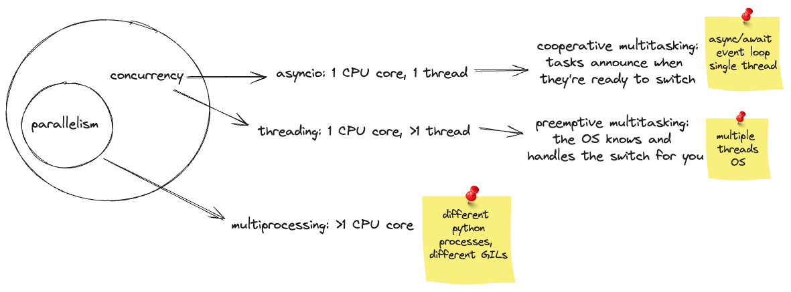

### asyncio basics in Python

This repository is for study purposes. Is a high level overview of the asyncio docs focusing on
methods that I'm using at work.

Overview of concurrency, using Python as language:



📌 The **event loop** is a core concept in asynchronous programming, a design pattern, acting as the
central executor in an asyncio-based application. It manages and distributes the execution of
different tasks, allowing for asynchronous tasks and callbacks to be executed, network IO operations
to be performed, and subprocesses to be run. It works by continuously cycling through pending tasks,
executing them, and then waiting for further tasks or IO events. This mechanism allows for
non-blocking concurrent execution, making it possible to handle high levels of IO-bound workloads
efficiently.

📌 A **coroutine** in Python is a function defined with `async def` and is designed to be used with
asynchronous operations. It can be paused and resumed at `await` points, allowing other code to run
during its idle time. Coroutines are a fundamental part of Python's asyncio library, enabling
concurrent execution of code. They are used for IO-bound and high-level structured network code.

📌 "asyncio exploits the fact that I/O operations release the GIL to give us concurrency, even with
only one thread. When we utilize asyncio we create objects called coroutines. A coroutine can be
thought of as executing a lightweight thread. Much like we can have multiple threads running at the
same time, each with their own concurrent I/O operation, we can have many coroutines running
alongside one another. While we are waiting for our I/O-bound coroutines to finish, we can still
execute other Python code, thus, giving us concurrency. It is important to note that asyncio does
not circumvent the GIL, and we are still subject to it."

Excerpt from [Python Concurrency with asyncio](https://www.amazon.com/Python-Concurrency-asyncio-Matthew-Fowler/dp/1617298662/ref=sr_1_1_sspa?crid=2QKFJ9WRYTPTU&dib=eyJ2IjoiMSJ9.PAOxJ9P-R3rVThT5b9VxApqAYGsuubdy5PE_tiwNukG3yilr2Aqe2YYjMRzrQnQHHmDqyPb5ClA_rgVS-0hMUfTXm5MElm11M_27Vc6tDvWwR3zHKiWedxDt6XiQGCZUEYo3ogEz27TSCXsyDHhQQnqRRpiDrUisjI0u3pj-H74e-NQz2DztIZN1eBiD8D7hQ44HDGk0DBUUUbbc3wRrAoht_fqSDsOpCE25aHlEBHY.o8obhSS_gX0jJfdV45SovZXROWoQHa-pLgQefeb-mLA&dib_tag=se&keywords=concurrency+python&qid=1720082291&sprefix=concurrency+pytho%2Caps%2C173&sr=8-1-spons&sp_csd=d2lkZ2V0TmFtZT1zcF9hdGY&psc=1)
by Matthew Fowler.

### [Event Loop](https://docs.python.org/3/library/asyncio-eventloop.html)

Event loops run asynchronous tasks and callbacks, perform network IO operations, and run
subprocesses.

Get the running event loop in the current OS thread:

```python
asyncio.get_running_loop()
```

This raise a `RuntimeError` if there is no running event loop. and can only be called from a
coroutine or a callback.

Get the current event loop:

```python
asyncio.get_event_loop()
```

Because this function has rather complex behavior using the `get_running_loop()` function is
preferred to `get_event_loop()` in coroutines and callbacks.

Obs.: `get_event_loop()` is deprecated.

Set loop as the current event loop for the current OS thread:

```python
asyncio.set_event_loop()
```

Create and return a new event loop object:

```python
asyncio.new_event_loop()
```

#### Running and stopping the loop

Run until the future (an instance of `Future`) has completed:

```python
loop.run_until_complete(future)
```

If the argument is a coroutine object it is implicitly scheduled to run as a `asyncio.Task`. Return
the Future’s result or raise its exception.

📌 A **Future** represents an eventual result of an asynchronous operation. Not thread-safe. Future
is an awaitable object. Coroutines can `await` on Future objects until they either have a result or
an exception set, or until they are cancelled. A Future can be awaited multiple times and the result
is same.

Run the event loop until `stop()` in called:

```python
loop.run_forever()
```

Stop the event loop:

```python
loop.stop()
```

Return `True` if the event loop is currently running:

```python
loop.is_running()
```

Return `True` if the event loop was closed:

```python
loop.is_closed()
```

Close the event loop:

```python
loop.close()
```

The loop must not be running when this function is called. Any pending callbacks will be discarded.
This method clears all queues and shuts down the executor, but does not wait for the executor to
finish.

### [Coroutines and tasks](https://docs.python.org/3/library/asyncio-task.html)

### [Futures](https://docs.python.org/3/library/asyncio-future.html)
